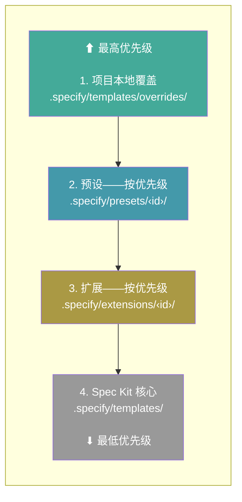
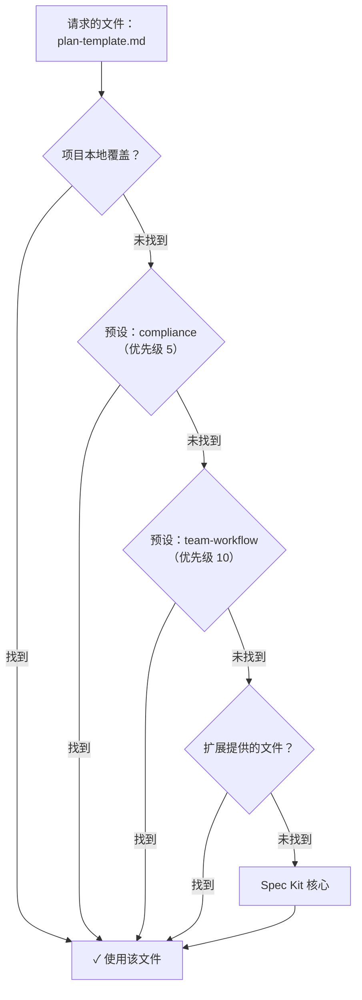

<!-- zh-source: docs/reference/presets.md -->
<!-- zh-base: 7624dd6 -->

# 预设

预设定制 Spec Kit 的工作方式——覆盖模板、命令和术语，而不改动任何工具本身。你可以用它强制执行组织标准、让工作流适配你的方法论，或者把整套体验本地化。多个预设可以按优先级叠加。

## 搜索可用预设

```bash
specify preset search [query]
```

| 选项 | 说明 |
| ---------- | -------------------- |
| `--tag`    | 按标签过滤 |
| `--author` | 按作者过滤 |

在所有生效的目录源中搜索匹配查询的预设。不带查询时，列出所有可用预设。

## 安装预设

```bash
specify preset add [<preset_id>]
```

| 选项 | 说明 |
| ---------------- | -------------------------------------------------------- |
| `--dev <path>`   | 从本地目录安装（用于开发） |
| `--from <url>`   | 从自定义 URL 安装，而不是目录源 |
| `--priority <N>` | 解析优先级（默认 10；数字越小优先级越高） |

从目录源、URL 或本地目录安装预设。预设的命令会自动注册到当前安装的 AI 编码智能体集成。

> **注意：** 所有预设命令都要求项目已经用 `specify init` 初始化过。

## 移除预设

```bash
specify preset remove <preset_id>
```

移除已安装的预设并清理其注册的命令。

## 列出已安装的预设

```bash
specify preset list
```

列出已安装的预设及其版本、描述、模板数量和当前状态。

## 预设详情

```bash
specify preset info <preset_id>
```

显示某个已安装或可用预设的详细信息，包括模板、元数据和标签。

## 解析文件

```bash
specify preset resolve <name>
```

通过追踪完整的解析栈，显示给定名称最终会使用哪个文件。当多个预设提供同一个文件时，这对调试很有用。

## 启用 / 禁用预设

```bash
specify preset enable <preset_id>
specify preset disable <preset_id>
```

禁用预设而不移除它。被禁用的预设在文件解析时会被跳过，但其命令仍保持注册。用 `enable` 重新启用。

## 设置预设优先级

```bash
specify preset set-priority <preset_id> <priority>
```

修改已安装预设的解析优先级。数字越小优先级越高。当多个预设提供同一个文件时，优先级数字最小的胜出。

## 目录源管理

预设目录源决定 `search` 和 `add` 从哪里查找预设。目录源按优先级顺序检查（数字越小优先级越高）。

### 列出目录源

```bash
specify preset catalog list
```

显示所有生效的目录源及其优先级和安装权限。

### 添加目录源

```bash
specify preset catalog add <url>
```

| 选项 | 说明 |
| -------------------------------------------- | -------------------------------------------------- |
| `--name <name>`                              | 必填。目录源的唯一名称 |
| `--priority <N>`                             | 优先级（默认 10；数字越小优先级越高） |
| `--install-allowed / --no-install-allowed`   | 是否允许从这个目录源安装预设（默认：仅用于发现） |
| `--description <text>`                       | 可选描述 |

把目录源添加到项目的 `.specify/preset-catalogs.yml`。

### 移除目录源

```bash
specify preset catalog remove <name>
```

从项目配置中移除一个目录源。

### 目录源解析顺序

目录源按以下顺序解析（第一个匹配者胜出）：

1. **环境变量** —— `SPECKIT_PRESET_CATALOG_URL` 覆盖所有目录源
2. **项目配置** —— `.specify/preset-catalogs.yml`
3. **用户配置** —— `~/.specify/preset-catalogs.yml`
4. **内置默认值** —— 官方目录源 + 社区目录源

`.specify/preset-catalogs.yml` 示例：

```yaml
catalogs:
  - name: "my-org-presets"
    url: "https://example.com/preset-catalog.json"
    priority: 5
    install_allowed: true
    description: "Our approved presets"
```

## 文件解析

预设可以提供命令文件、模板文件（如 `plan-template.md`）和脚本文件。每个文件名都独立地在优先级栈中求值，所以不同的文件可以来自不同的层。

模板和脚本在 Spec Kit 需要它们时才从栈中查找。命令使用同一个栈做替换与组合，但会被物化写入检测到的智能体目录，而不是由智能体重新解析。安装预设时，Spec Kit 会为正在安装的预设注册命令文件；安装后和移除后的对账（reconciliation）会基于当前生效的栈，重新计算并写出受影响命令的最终内容。智能体每次运行命令时并不会重新解析这个栈。

默认情况下，文件采用**替换（replace）**策略：优先级栈中的第一个匹配项胜出并被整体使用。模板和命令还可以使用组合策略：**前置（prepend）**把预设内容放在低优先级内容之前，**后置（append）**把它放在低优先级内容之后，**包裹（wrap）**用低优先级内容替换 `{CORE_TEMPLATE}` 占位符。脚本支持 **replace** 和 **wrap**；脚本包裹使用 `$CORE_SCRIPT` 作为占位符。

解析栈，从最高优先级到最低优先级：

1. **项目本地覆盖** —— `.specify/templates/overrides/`
2. **已安装的预设** —— 按优先级排序（数字小的先检查）
3. **已安装的扩展** —— 按优先级排序
4. **Spec Kit 核心** —— `.specify/templates/`

### 解析栈



每一层内部，文件按类型组织：

| 类型 | 子目录 | 覆盖路径 |
| --------- | -------------- | ------------------------------------------ |
| 模板 | `templates/`   | `.specify/templates/overrides/` |
| 命令 | `commands/`    | `.specify/templates/overrides/` |
| 脚本 | `scripts/`     | `.specify/templates/overrides/scripts/` |

### 解析过程示意



### 示例

```bash
specify preset add compliance --priority 5
specify preset add team-workflow --priority 10
```

对于两者都提供的文件，`compliance` 胜出（优先级 5 < 10）。只有一方提供的文件，就用那一方的。两者都不提供的文件，使用核心默认值。

## 常见问题

### 可以同时使用多个预设吗？

可以。预设按优先级叠加——每个文件都独立解析，取提供它的最高优先级来源。用 `specify preset set-priority` 控制顺序。

### 怎么查看实际使用的是哪个文件？

运行 `specify preset resolve <name>` 追踪解析栈，看看哪个文件胜出。

### 禁用和移除预设有什么区别？

**禁用**（`specify preset disable`）保持预设的安装状态，但把它排除在之后的模板与脚本解析之外。已经注册的命令在预设被移除之前仍然在你的 AI 编码智能体中可用——所以当你需要让命令变更停止生效时，请用移除。禁用适合临时测试没有某个预设时的模板/脚本行为，或对比有无该预设时的模板/脚本输出。随时可以用 `specify preset enable` 重新启用。

**移除**（`specify preset remove`）会完整卸载预设——删除其文件、从你的 AI 编码智能体中注销其命令，并将其从注册表中移除。

### 预设由谁维护？

大多数预设由各自的作者独立创建和维护。Spec Kit 维护者不会审查、审计、背书或支持预设代码。安装前请审查预设的源码，使用风险自行判断。特定预设的问题请联系其作者，或在该预设的仓库中提交 issue。
