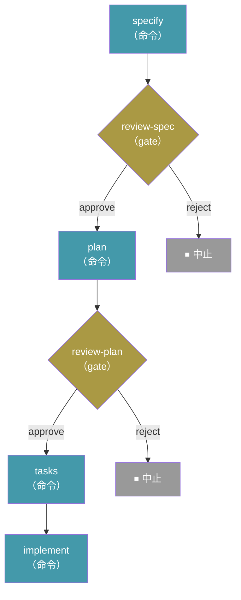

<!-- zh-source: docs/reference/workflows.md -->
<!-- zh-base: 6688b44 -->

# 工作流

工作流把多步骤的规范驱动开发过程自动化——将命令、提示词、shell 步骤和人工检查点串成可复用的执行序列。工作流支持条件逻辑、循环、扇出/扇入（fan-out/fan-in），并且可以暂停后从中断的确切位置恢复。

## 运行工作流

```bash
specify workflow run <source>
```

| 选项 | 说明 |
| ------------------- | -------------------------------------------------------- |
| `-i` / `--input`    | 以 `key=value` 形式传入输入值（可重复） |
| `--json`            | 以单个 JSON 对象输出运行结果 |

从目录源 ID、URL 或本地文件路径运行工作流。工作流声明的输入可以通过 `--input` 提供，否则会交互式提示输入。

示例：

```bash
specify workflow run speckit -i spec="构建一个支持拖拽任务管理的看板应用" -i scope=full
```

带 `--json` 时，会打印单个机器可读对象，取代格式化文本（不带该标志时默认输出不变）：

```bash
specify workflow run my-pipeline.yml --json
```

```json
{
  "run_id": "662bf791",
  "workflow_id": "build-and-review",
  "status": "paused",
  "current_step_id": "review",
  "current_step_index": 0
}
```

`workflow_id` 是 YAML 中声明的 `workflow.id`，不是文件名。该对象严格按所示格式打印——两空格缩进的美化输出，写到纯 stdout，不含任何 Rich 标记——因此始终可以被解析。在 `--json` 模式下运行工作流时，步骤本应打印的任何进度信息（例如 gate 步骤的提示，或 prompt 步骤 CLI 子进程的输出）都会被重定向到 stderr，stdout 上只承载这个 JSON 对象。请从 stdout 读取该对象；stderr 保持连接到终端，或单独捕获。

> **注意：** 大多数工作流命令要求项目已经用 `specify init` 初始化过。例外是 `specify workflow run <local-file.{yml,yaml}>`，它可以在项目之外运行；此时运行状态存储在当前目录的 `.specify/workflows/runs/<run_id>/` 下。

## 恢复工作流

```bash
specify workflow resume <run_id>
```

| 选项 | 说明 |
| ------------------- | -------------------------------------------------------- |
| `-i` / `--input`    | 以 `key=value` 形式更新输入值（可重复） |
| `--json`            | 以单个 JSON 对象输出恢复结果 |

从暂停或失败的确切步骤恢复一次工作流运行。适用于响应完 gate 步骤之后，或修复了导致失败的问题之后。

提供的 `--input` 值会合并到该次运行已存储的输入之上，按工作流声明的输入类型重新校验，然后用更新后的值重新运行被阻塞的步骤。这样，一次运行可以带着暂停后才拿到的信息继续，也可以在失败后用修正过的值继续：

```bash
specify workflow resume <run_id> --input cmd="exit 0"
```

## 工作流状态

```bash
specify workflow status [<run_id>]
```

| 选项 | 说明 |
| ------------------- | -------------------------------------------------------- |
| `--json`            | 以 JSON 对象输出运行状态（或运行列表） |

显示某次运行的状态；不给 ID 时列出所有运行。运行状态有：`created`、`running`、`completed`、`paused`、`failed`、`aborted`。

## 列出已安装的工作流

```bash
specify workflow list
```

列出当前项目中已安装的工作流。

## 安装工作流

```bash
specify workflow add <source>
```

| 选项 | 说明 |
| --------------- | ------------------------------------------------------ |
| `--dev`         | 从本地工作流 YAML 文件或目录安装 |
| `--from <url>`  | 从自定义 URL 安装（`<source>` 用来指定期望的工作流 ID） |

从目录源、URL（必须是 HTTPS）或本地文件路径安装工作流。

## 更新工作流

```bash
specify workflow update [workflow_id]
```

把某个已安装的目录源工作流——不给 ID 时则是全部——更新到目录源中的最新版本。会提示确认；如果下载或校验失败，保留已安装的副本。

## 启用或禁用工作流

```bash
specify workflow enable <workflow_id>
specify workflow disable <workflow_id>
```

被禁用的工作流仍保持安装并出现在列表中（标注为 `[disabled]`），但在重新启用之前拒绝运行。

## 移除工作流

```bash
specify workflow remove <workflow_id>
```

从项目中移除一个已安装的工作流。

## 搜索可用工作流

```bash
specify workflow search [query]
```

| 选项 | 说明 |
| ---------- | ----------------- |
| `--tag`    | 按标签过滤 |
| `--author` | 按作者过滤 |

在所有生效的目录源中搜索匹配查询的工作流。

## 工作流详情

```bash
specify workflow info <workflow_id>
```

显示工作流的详细信息，包括步骤、输入和运行要求。

## 目录源管理

工作流目录源决定 `search` 和 `add` 从哪里查找工作流。目录源按优先级顺序检查。

### 列出目录源

```bash
specify workflow catalog list
```

显示所有生效的目录源。

### 添加目录源

```bash
specify workflow catalog add <url>
```

| 选项 | 说明 |
| --------------- | -------------------------------- |
| `--name <name>` | 目录源的可选名称 |

把自定义目录源 URL 添加到项目的 `.specify/workflow-catalogs.yml`。

### 移除目录源

```bash
specify workflow catalog remove <index>
```

按目录源列表中的索引移除一个目录源。

### 目录源解析顺序

目录源按以下顺序解析（第一个匹配者胜出）：

1. **环境变量** —— `SPECKIT_WORKFLOW_CATALOG_URL` 覆盖所有目录源
2. **项目配置** —— `.specify/workflow-catalogs.yml`
3. **用户配置** —— `~/.specify/workflow-catalogs.yml`
4. **内置默认值** —— 官方目录源 + 社区目录源

## 工作流定义

工作流用 YAML 文件定义。下面是 Spec Kit 内置的 **Full SDD Cycle**（完整规范驱动开发循环）工作流：

```yaml
schema_version: "1.0"
workflow:
  id: "speckit"
  name: "Full SDD Cycle"
  version: "1.0.0"
  author: "GitHub"
  description: "Runs specify → plan → tasks → implement with review gates"

requires:
  speckit_version: ">=0.7.2"
  integrations:
    any: ["copilot", "claude", "gemini"]

inputs:
  spec:
    type: string
    required: true
    prompt: "Describe what you want to build"
  integration:
    type: string
    default: "copilot"
    prompt: "Integration to use (e.g. claude, copilot, gemini)"
  scope:
    type: string
    default: "full"
    enum: ["full", "backend-only", "frontend-only"]

steps:
  - id: specify
    command: speckit.specify
    integration: "{{ inputs.integration }}"
    input:
      args: "{{ inputs.spec }}"

  - id: review-spec
    type: gate
    message: "Review the generated spec before planning."
    options: [approve, reject]
    on_reject: abort

  - id: plan
    command: speckit.plan
    integration: "{{ inputs.integration }}"
    input:
      args: "{{ inputs.spec }}"

  - id: review-plan
    type: gate
    message: "Review the plan before generating tasks."
    options: [approve, reject]
    on_reject: abort

  - id: tasks
    command: speckit.tasks
    integration: "{{ inputs.integration }}"
    input:
      args: "{{ inputs.spec }}"

  - id: implement
    command: speckit.implement
    integration: "{{ inputs.integration }}"
    input:
      args: "{{ inputs.spec }}"
```

它产生如下的执行流程：



运行方式：

```bash
specify workflow run speckit -i spec="构建一个支持拖拽任务管理的看板应用"
```

## 步骤类型

| 类型 | 用途 |
| ------------ | ------------------------------------------------ |
| `command`    | 调用一个 Spec Kit 命令（例如 `speckit.plan`） |
| `prompt`     | 向 AI 编码智能体发送任意提示词 |
| `shell`      | 执行 shell 命令并捕获输出 |
| `init`       | 引导初始化一个项目（类似 `specify init`） |
| `gate`       | 暂停等待人工批准后再继续 |
| `if`         | 条件分支（then/else） |
| `switch`     | 基于表达式的多分支调度 |
| `while`      | 条件为真时循环 |
| `do-while`   | 至少执行一次，然后按条件循环 |
| `fan-out`    | 为列表中的每一项分发一个步骤 |
| `fan-in`     | 聚合 fan-out 步骤的结果 |

> **安全提示：** `shell` 步骤以**你自己**的权限运行本地命令。这里没有能力沙箱——`requires` 只是建议性的前置条件块（spec-kit 版本、集成），不是运行时门禁，因此它**不会**限制步骤能做什么。特别地，不存在 `requires.permissions` 这样的能力门禁：校验会直接拒绝它，正是因为它会暗示一个并不存在的沙箱。运行任何来自目录源或下载的工作流之前请先审查其内容，并用 `gate` 步骤在敏感或破坏性的 shell 命令之前要求显式批准。

## 表达式

步骤可以用 `{{ expression }}` 语法引用输入和之前步骤的输出：

| 命名空间 | 说明 |
| ------------------------------ | ------------------------------------ |
| `inputs.spec`                  | 工作流输入值 |
| `steps.specify.output.file`    | 之前某个步骤的输出 |
| `item`                         | fan-out 迭代中的当前项 |
| `context.run_id`               | 当前工作流运行 ID |
| `context.workflow_dir`         | 解析后的工作流源目录绝对路径。以字符串方式加载的工作流为空字符串。 |

可用的过滤器：`default`、`join`、`contains`、`map`、`from_json`。

示例：

```yaml
condition: "{{ steps.test.output.exit_code == 0 }}"
args: "{{ inputs.spec }}"
message: "{{ status | default('pending') }}"
```

## Shell 步骤的环境变量

Shell 步骤会自动获得以下环境变量：

| 变量 | 说明 |
| -------- | ----------- |
| `SPECKIT_WORKFLOW_DIR` | 解析后的工作流源目录绝对路径（与 `{{ context.workflow_dir }}` 值相同）。工作流没有源路径时不设置。 |

## 输入类型

| 类型 | 类型转换 |
| --------- | ------------------------------------------------- |
| `string`  | 原样传递 |
| `number`  | `"42"` → `42`，`"3.14"` → `3.14` |
| `boolean` | `"true"` / `"1"` / `"yes"` → `True` |

## 状态与恢复

每次工作流运行的状态持久化在 `.specify/workflows/runs/<run_id>/`：

- `state.json` —— 当前运行状态与步骤进度
- `inputs.json` —— 解析后的输入值
- `log.jsonl` —— 逐步骤的执行日志

这使得 `specify workflow resume` 能从运行暂停（例如停在某个 gate）或失败的确切步骤继续。

## 常见问题

### 工作流遇到 gate 步骤会发生什么？

工作流会暂停并等待人工输入。审查完毕后运行 `specify workflow resume <run_id>` 继续。

### 同一个工作流可以运行多次吗？

可以。每次运行获得唯一 ID 和独立的状态目录。用 `specify workflow status` 查看所有运行。

### 工作流由谁维护？

大多数工作流由各自的作者独立创建和维护。Spec Kit 维护者不会审查、审计、背书或支持工作流代码。安装前请审查工作流的源码，使用风险自行判断。
