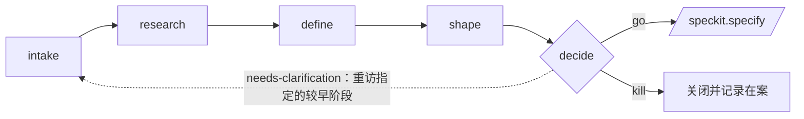

<!-- zh-source: extensions/assess/README.md -->
<!-- zh-base: 208d386 -->

# 创意评估流水线扩展

一条为 Spec Kit 打造的五阶段评估流水线，能把**任何创意**变成一个可辩护的 **go / needs-clarification / kill**（推进 / 需澄清 / 终止）决策——就在创意进入规范驱动开发*之前*。它是那条缺失的**发现轨道**（discovery track），位于规范驱动开发的**交付轨道**（delivery track，`specify → clarify → plan → tasks → analyze → implement`）之前。

发现轨道回答*"这值得做吗？"*，交付轨道回答*"我们该怎么做？"*。只有通过评估存活下来的创意才会交接给 `/speckit.specify`。

## 概览

每个创意都有自己的目录，位于 `.specify/assessments/<slug>/` 下，每个阶段各产出一份 Markdown 产物：

```
.specify/assessments/<slug>/
├── intake.md      # speckit.assess.intake   — 接收原始创意
├── research.md    # speckit.assess.research — 收集证据（并用证据挑战创意）
├── problem.md     # speckit.assess.define   — 定义问题、目标、指标
├── concept.md     # speckit.assess.shape    — 塑形解决方案选项 + 投入预算
└── decision.md    # speckit.assess.decide   — go / needs-clarification / kill → 交接
```

这条流水线是一个**漏斗**：大多数创意应当在 `shape` 之前就被终止或搁置。带着有据可查的理由终止一个创意是一种成功的结果，而不是失败。



## 命令

| 命令 | 阶段 | 输出 |
|---------|-------|--------|
| `speckit.assess.intake` | 接收并规范化一个原始创意（文本、URL、工单或代码库指针）。 | `intake.md` |
| `speckit.assess.research` | 收集用户/市场/先例/数据方面的证据——以及*反对*该创意的证据。 | `research.md` |
| `speckit.assess.define` | 定义问题：用户、目标、非目标、成功指标、不作为的代价。 | `problem.md` |
| `speckit.assess.shape` | 塑形 2–3 个概念层面的选项，附投入预算与权衡；推荐其中一个（或一个都不推荐）。 | `concept.md` |
| `speckit.assess.decide` | 对照标准评分并给出判定；把 `go` 的创意交接给 `/speckit.specify`。 | `decision.md` |

各阶段本应按顺序运行，但并非被严格设卡拦截：

- `define` 是最小可行阶段，可以直接基于用户输入运行（intake/research 可选）。
- `shape` 需要 `problem.md`。
- `decide` 需要 `problem.md`；`go` 判定期望有 `concept.md`（否则会被降级为 `needs-clarification`）。

## Slug 约定

*slug*（短标识名）是 `.specify/assessments/` 下每个创意的目录名。它是全部五个命令共享的唯一句柄。

- **用户提供**：规范化为小写 kebab-case（例如 `offline-mode`、`cut-onboarding-friction`）。规范化之后按原样保留——不追加时间戳或编号。
- **主动询问**：交互式使用时，若未提供 slug，`speckit.assess.intake` 会向用户询问，并根据创意给出一个 kebab-case 的默认建议。
- **自动化场景**：没有人可问时，智能体自行生成一个唯一的 slug，绝不覆盖已有的评估目录（按需追加 `-2`、`-3`、……或一个短日期）。
- **从上下文复用**：后续阶段复用同一会话中较早报告过的 slug，并通过评估目录是否存在来确认。

## 安装

```bash
specify extension add assess
```

## 停用

```bash
specify extension disable assess
specify extension enable assess
```

## 典型流程

```bash
# 1. 接收一个创意（粘贴的文本、一个 URL，或"评估这个仓库"）
/speckit.assess.intake "让用户能离线工作，重新联网后再同步" slug=offline-mode

# 2. 收集证据——以及它可能不值得做的理由
/speckit.assess.research slug=offline-mode

# 3. 定义真正的问题
/speckit.assess.define slug=offline-mode

# 4. 塑形 2–3 个概念选项，各带投入预算
/speckit.assess.shape slug=offline-mode

# 5. 决策——推进、澄清或终止
/speckit.assess.decide slug=offline-mode
# → 判定为 "go" 时，把 decision.md 的交接摘要递交给 /speckit.specify
```

## 交接

`assess` 是一条**你有意进入的独立流水线**——它不注册任何生命周期钩子，也绝不把自己插入 `/speckit.specify`。唯一的耦合是向前的、出于自主选择的：`/speckit.assess.decide` 给出的 `go` 判定会把它的 `decision.md` 摘要交接给 `/speckit.specify`。发现与规范化始终是彼此独立的两个过程。

## 护栏

- 只有 `speckit.assess.*` 命令会写入，并且只写在 `.specify/assessments/<slug>/` 内。**它们都不修改源代码**——解决方案设计与实现属于规范驱动开发的生命周期（`/speckit.specify` 之后）。
- `intake`/`research` 期间从网络抓取的内容一律当作不可信数据处理，受一套明确的 URL 信任策略约束（列入白名单的公共来源可自由抓取；未知主机需询问或跳过；环回/RFC1918/元数据端点一律拒绝）。
- 证据绝不夸大：没有出处的陈述标记为 `ASSUMPTION`，且 `research.md` 始终包含一个*反对该创意的证据*小节。
- 判定绝不夸大：`go` 要求有一个成立的问题、`adequate` 及以上的证据（绝不能是 weak/unknown），以及一个已塑形的概念；否则诚实的判定就是 `needs-clarification`。
- slug 会被规范化为 `[a-z0-9-]`，空结果会被拒绝；在任何读写之前，每个命令还会拒绝带符号链接的路径分量，并核验解析后的路径仍留在项目根目录内——因此评估目录绝不会逃出 `.specify/assessments/`，即便在被精心构造或克隆过的项目中也是如此。
- 任何命令都不会在未经确认的情况下覆盖已有的产物；在自动化模式下它会直接拒绝。

## 与其他扩展的关系

`assess` 被有意设计成**通用、角色中立**的发现轨道——创始人、产品经理、业务分析师、工程师或设计师都能用。社区目录源中更丰富或更专门化的 pre-SDD 流程（例如产品生命周期编排器、技术发现、intake 规范化、存量项目上手引导）可以叠加在它之上或向它供料；而 `assess` 立志成为那个精简、有明确主张、干净地终止于 `/speckit.specify` 交接点的漏斗。
