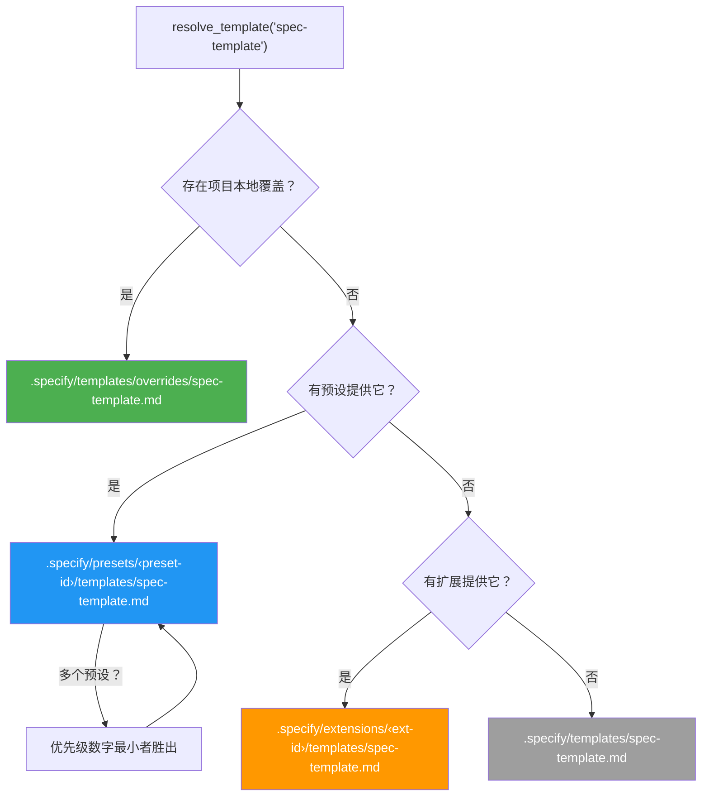
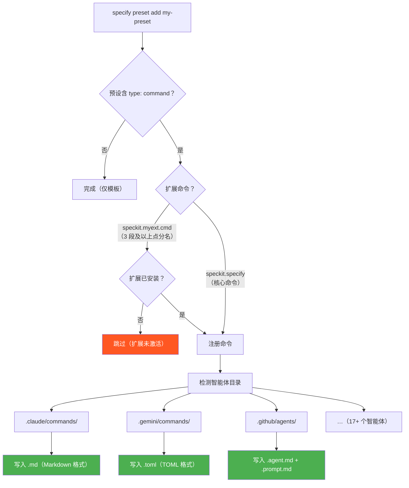
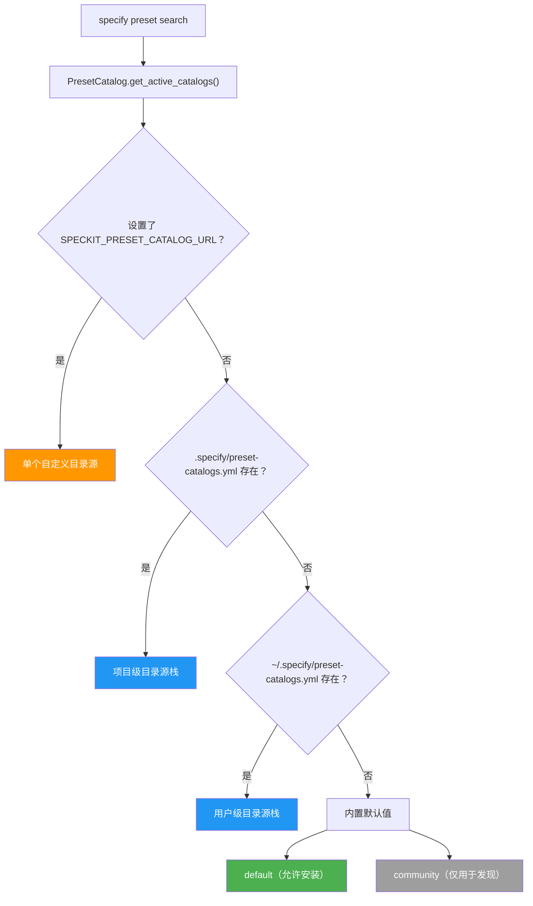

<!-- zh-source: presets/ARCHITECTURE.md -->
<!-- zh-base: e649bbd -->

# 预设系统架构

本文档描述预设系统的内部架构——模板解析、命令注册和目录源管理在底层是如何工作的。

使用说明见 [README.md](README.md)。

## 模板解析

当 Spec Kit 需要某个模板（例如 `spec-template`）时，`PresetResolver` 会遍历一个优先级栈，返回第一个匹配项：



| 优先级 | 来源 | 路径 | 使用场景 |
|----------|--------|------|----------|
| 1（最高） | 覆盖项 | `.specify/templates/overrides/` | 一次性的项目本地调整 |
| 2 | 预设 | `.specify/presets/<id>/templates/` | 可共享、可叠加的定制 |
| 3 | 扩展 | `.specify/extensions/<id>/templates/` | 扩展提供的模板 |
| 4（最低） | 核心 | `.specify/templates/` | 随工具自带的默认值 |

安装了多个预设时，它们按各自的 `priority` 字段排序（数字越小优先级越高）。该字段通过 `specify preset add` 的 `--priority` 选项设置。

解析逻辑实现了三份，以保证一致性：

- **Python**：`src/specify_cli/presets.py` 中的 `PresetResolver`
- **Bash**：`scripts/bash/common.sh` 中的 `resolve_template()`
- **PowerShell**：`scripts/powershell/common.ps1` 中的 `Resolve-Template`

### 组合策略

模板、命令和脚本支持 `strategy` 字段，用来控制预设内容与低优先级内容如何组合，而不是完全替换：

| 策略 | 说明 | 模板 | 命令 | 脚本 |
|----------|-------------|-----------|----------|---------|
| `replace`（默认） | 完全替换低优先级内容 | ✓ | ✓ | ✓ |
| `prepend` | 把内容放在低优先级内容之前（用空行分隔） | ✓ | ✓ | — |
| `append` | 把内容放在低优先级内容之后（用空行分隔） | ✓ | ✓ | — |
| `wrap` | 内容中包含 `{CORE_TEMPLATE}`（模板/命令）或 `$CORE_SCRIPT`（脚本）占位符，占位符会被低优先级内容替换 | ✓ | ✓ | ✓ |

组合是递归的——多个使用组合策略的预设会串联。`PresetResolver.resolve_content()` 方法自底向上遍历完整的优先级栈，逐层应用各自的策略。

用于组合的内容解析函数：

- **Python**：`src/specify_cli/presets.py` 中的 `PresetResolver.resolve_content()`（模板、命令和脚本）
- **Bash**：`scripts/bash/common.sh` 中的 `resolve_template_content()`（仅模板；命令/脚本组合由 Python 解析器处理）
- **PowerShell**：`scripts/powershell/common.ps1` 中的 `Resolve-TemplateContent`（仅模板；命令/脚本组合由 Python 解析器处理）

## 命令注册

当安装的预设包含 `type: "command"` 条目时，`PresetManager` 会使用 `src/specify_cli/agents.py` 中共享的 `CommandRegistrar`，把这些命令注册到所有检测到的智能体目录。



### 扩展安全检查

命令名遵循 `speckit.<ext-id>.<cmd-name>` 的模式。当命令名包含 3 段及以上的点分段时，系统会提取扩展 ID 并检查 `.specify/extensions/<ext-id>/` 是否存在。如果扩展没有安装，该命令会被跳过——避免产生引用不存在扩展的孤儿文件。

核心命令（例如 `speckit.specify`，只有 2 段）始终会被注册。

### 智能体格式渲染

`CommandRegistrar` 针对不同智能体以不同格式渲染命令：

| 智能体 | 格式 | 扩展名 | 参数占位符 |
|-------|--------|-----------|-----------------|
| Claude、Kilo Code、opencode 等 | Markdown | `.md` | `$ARGUMENTS` |
| Copilot | Markdown | `.agent.md` + `.prompt.md` | `$ARGUMENTS` |
| Gemini、Qwen、Tabnine | TOML | `.toml` | `{{args}}` |

### 移除时的清理

调用 `specify preset remove` 时，系统会从注册表元数据中读出已注册的命令，并从每个智能体目录中删除对应文件，包括 Copilot 配套的 `.prompt.md` 文件。

## 目录源系统



目录源获取带有 1 小时缓存（按 URL 缓存，缓存文件名为 SHA256 哈希）。每个目录源条目都有 `priority`（用于合并排序）和 `install_allowed` 标志。

## 仓库布局

```
presets/
├── ARCHITECTURE.md                         # 本文件
├── PUBLISHING.md                           # 向目录源提交预设的指南
├── README.md                               # 用户指南
├── catalog.json                            # 官方预设目录源
├── catalog.community.json                  # 社区预设目录源
├── scaffold/                               # 用于创建新预设的脚手架
│   ├── preset.yml                          # 清单示例
│   ├── README.md                           # 定制脚手架的指南
│   ├── commands/
│   │   ├── speckit.specify.md              # 核心命令覆盖示例
│   │   └── speckit.myext.myextcmd.md       # 扩展命令覆盖示例
│   └── templates/
│       ├── spec-template.md                # 核心模板覆盖示例
│       └── myext-template.md               # 扩展模板覆盖示例
└── self-test/                              # 自测预设（覆盖所有核心模板）
    ├── preset.yml
    ├── commands/
    │   └── speckit.specify.md
    └── templates/
        ├── spec-template.md
        ├── plan-template.md
        ├── tasks-template.md
        ├── checklist-template.md
        └── constitution-template.md
```

## 模块结构

```
src/specify_cli/
├── agents.py       # CommandRegistrar —— 把命令文件写入智能体目录的共享基础设施
├── presets.py       # PresetManifest、PresetRegistry、PresetManager、
│                    #   PresetCatalog、PresetCatalogEntry、PresetResolver
└── __init__.py      # CLI 命令：specify preset list/add/remove/search/
                     #   resolve/info，specify preset catalog list/add/remove
```
